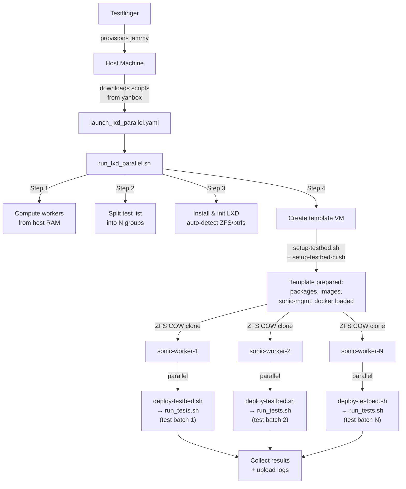
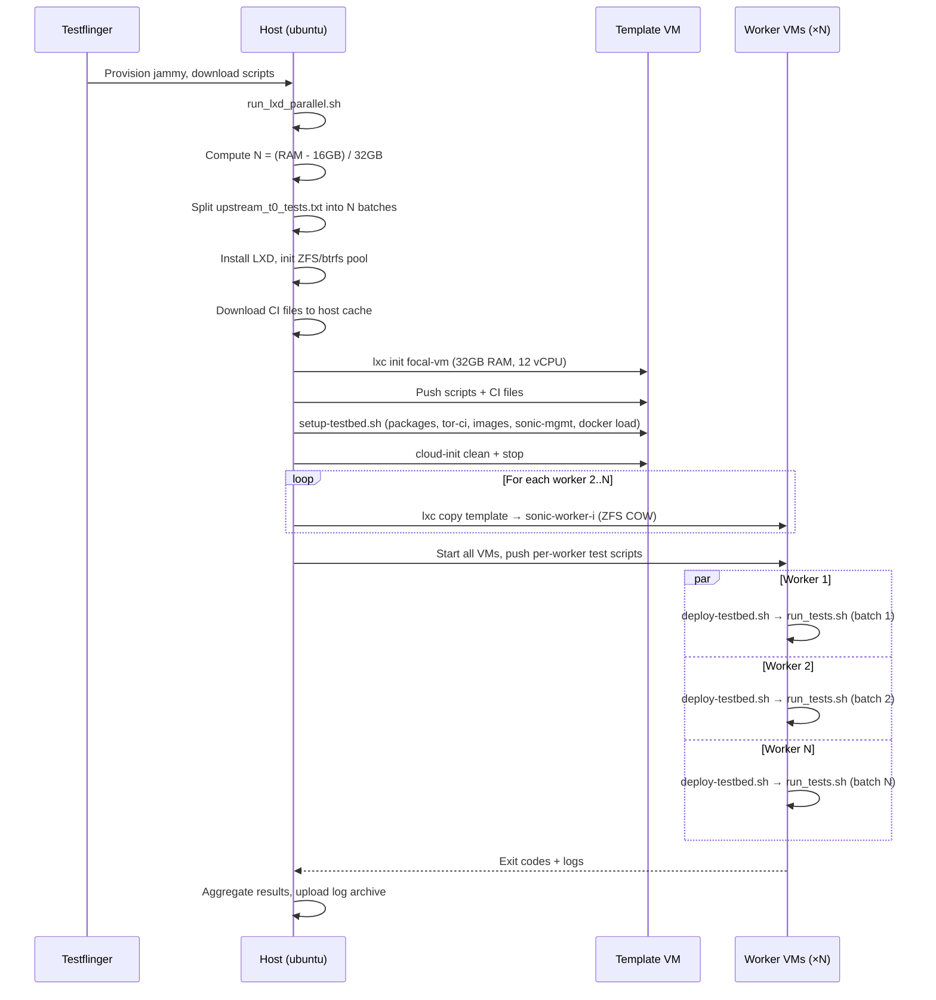
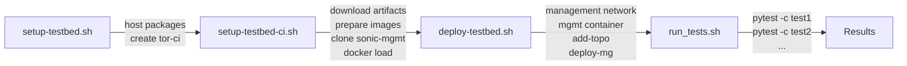

# Testflinger CI Refactoring & Sonic Repository Architecture

## 1. Background: The Journey

### Original Goal

Run the SONiC VS (virtual switch) test suite on testflinger and report test case pass/fail status for the 202405 release.

### Problem 1: Outdated sonic-mgmt fork

The initial testflinger setup (`vs_build_run.yaml.j2`) used `jy5275/sonic-mgmt` on the `sonic_on_ubuntu` branch — a very old fork based on upstream master. This worked for early prototyping but is far behind the 202405 release test suite. We switched to `canonical/sonic-mgmt` on the `ubuntu-sonic-202405` branch to get the correct, up-to-date tests.

### Problem 2: docker-sonic-mgmt version mismatch

After switching to the 202405 sonic-mgmt branch, the tests failed because the **Docker Hub `docker-sonic-mgmt:latest`** image (which `setup-container.sh` pulls by default) is built from upstream master and carries Python packages/Ansible versions incompatible with the 202405 test suite.

This meant we had to **build `docker-sonic-mgmt` locally** from sonic-buildimage to get a matching container image.

### Problem 3: Building docker-sonic-mgmt locally

Building `docker-sonic-mgmt` from sonic-buildimage turned out to be surprisingly painful:

1. **`NOBULLSEYE` / `NONOBLE` flags**: `docker-sonic-mgmt` is registered as a **Bullseye-only** docker target (`SONIC_BULLSEYE_DOCKERS` in `rules/docker-sonic-mgmt.mk`). The top-level `Makefile` defaults to `NOBULLSEYE=1` (Bullseye disabled). So a plain `make` skips it entirely. You must set `NOBULLSEYE=0` to enable the Bullseye build environment, and `NONOBLE=1` to avoid also building the Noble environment (which doesn't include docker-sonic-mgmt anyway).

2. **`LEGACY_SONIC_MGMT_DOCKER` trap**: This flag controls whether Python 2 is included in the container. The catch:
   - `Makefile.work` defaults it to **`y`** (legacy mode with Python 2)
   - `rules/config.user` overrides it to **`n`** (Python 3 only)
   - But `Makefile.work`'s default takes effect **before** `config.user` is loaded in certain build paths
   - The legacy build installs `ansible==2.8.20`, which pushes **old helper scripts** to the DUT and host via Ansible modules. These scripts use the `imp` module (removed in Python 3.12) and depend on an ancient version of `six`, causing them to crash at runtime on the DUT/host
   - Debugging which mode was actually active cost significant time

3. **Host OS constraint (202405)**: The 202405 test suite requires the testflinger host to be **Ubuntu 22.04 (Jammy) or below**. Ubuntu 24.04 (Noble) ships Python 3.12 which removes the `imp` module entirely, breaking Ansible's generated scripts even with the non-legacy build. This is why we provision `jammy` in testflinger

4. **The correct local build command**:
   ```bash
   NOBULLSEYE=0 NONOBLE=1 LEGACY_SONIC_MGMT_DOCKER=n make target/docker-sonic-mgmt.gz
   ```

### Problem 4: Hardcoded environment in sonic-mgmt

The upstream sonic-mgmt repo ships placeholder values like `ansible_user: use_own_value` in its inventory and credential files. Previously, these were patched **directly in the sonic-mgmt fork** — hardcoding usernames, cEOS versions, and passwords into committed files. This is fragile:

- Every new clone or branch switch requires re-applying the patches
- The fork drifts from upstream, making rebases painful
- Different lab environments (testflinger vs local dev) need different values
- AppArmor `seclabel` settings in libvirt XML templates also need per-environment overrides

We extracted all of this into `setup-local-env.sh` — a standalone script that patches a clean sonic-mgmt checkout at runtime:

| What it patches | File | Change |
|----------------|------|--------|
| ansible_user / vm_host_user | `ansible/group_vars/vm_host/creds.yml`, `ansible/veos_vtb` | Sets to `tor-ci` (configurable via `-u`) |
| cEOS image version | `ansible/group_vars/vm_host/ceos.yml` | Updates all references to `4.32.5M` (configurable via `-c`) |
| AppArmor seclabel | `ansible/*.xml.j2` | Changes `dynamic/apparmor` to `type='none'` (opt-in via `-a`) |
| password.txt | `ansible/password.txt` | Creates with configurable password (default: `tor-ci`) |
| cached_topologies | `ansible/.cached_topologies/` | Creates directory and path file |

This means sonic-mgmt can stay as a clean upstream clone — no more committing environment-specific hacks.

### Solution: Pre-build artifacts and externalize config
1. Build `docker-sonic-mgmt.gz` once on yanbox with the correct flags
2. Serve it via HTTP (`http://10.239.7.20:8000/docker-sonic-mgmt.gz`)
3. `setup-testbed.sh` downloads and loads it via `docker load`, skipping Docker Hub entirely

---

## 2. Testflinger Refactoring

### Before: Monolithic Inline YAML

The old approach (`vs_build_run.yaml.j2`, `vs_test_only.yaml.j2`, `vs_parallel_test.yaml.j2`) embedded all logic directly in the `test_cmds` block — 60–120 lines of inline shell per YAML template:

```yaml
test_data:
  test_cmds: |
    # 1. Install packages (duplicated in every template)
    ssh ubuntu@$DEVICE_IP sudo apt install -y docker-ce python3 ...
    # 2. Download images (different methods per template)
    ssh ubuntu@$DEVICE_IP gdown -O .../cEOS64-lab-4.32.5M.tar.xz https://drive.google.com/uc?id=...
    # 3. Clone sonic-mgmt
    ssh ubuntu@$DEVICE_IP git clone -b {{ sonic_mgmt_branch }} ...
    # 4. Setup container (pulls docker-sonic-mgmt from Docker Hub)
    ssh ubuntu@$DEVICE_IP "cd sonic-mgmt && ./setup-container.sh ..."
    # 5. Deploy & test
    ssh ubuntu@$DEVICE_IP docker exec mgmt ./testbed-cli.sh ...
```

**Problems:**
- Massive duplication across 3+ templates with subtle inconsistencies (`focal` vs `jammy`, different package lists)
- Everything runs as `ubuntu` user with `chmod a+rw /var/run/docker.sock`
- cEOS downloaded from Google Drive via `gdown`/`pipx` — fragile and slow
- `docker-sonic-mgmt` always pulled from Docker Hub — wrong version for 202405
- Not idempotent — re-running fails on "directory exists" errors
- Requires Jinja2 rendering before submission
- Hard to test locally or iterate on

### After: Modular Shell Scripts

The YAML job is now minimal — it downloads scripts from yanbox to the device and runs the orchestrator:

```yaml
test_data:
  test_cmds: |
    SSH="ssh -o StrictHostKeyChecking=no ubuntu@$DEVICE_IP"
    YANBOX=http://10.239.7.20:8000

    $SSH "curl -f -o ~/run_lxd_parallel.sh   $YANBOX/run_lxd_parallel.sh"
    $SSH "curl -f -o ~/setup-testbed.sh      $YANBOX/setup-testbed.sh"
    $SSH "curl -f -o ~/setup-testbed-ci.sh   $YANBOX/setup-testbed-ci.sh"
    $SSH "curl -f -o ~/deploy-testbed.sh     $YANBOX/deploy-testbed.sh"
    $SSH "curl -f -o ~/setup-local-env.sh    $YANBOX/setup-local-env.sh"
    $SSH "curl -f -o ~/upstream_t0_tests.txt $YANBOX/upstream_t0_tests.txt"
    $SSH "chmod +x ~/run_lxd_parallel.sh ~/setup-testbed.sh ~/setup-testbed-ci.sh ~/deploy-testbed.sh ~/setup-local-env.sh"
    $SSH "bash -x ~/run_lxd_parallel.sh 10.239.7.20"
```

The actual logic lives in shell scripts with clear separation of concerns:

| Script | Runs on | Purpose |
|--------|---------|---------|
| `run_lxd_parallel.sh` | Host (ubuntu) | Top-level orchestrator: compute workers, split tests, create LXD VMs, run parallel tests |
| `setup-testbed.sh` | LXD VM (ubuntu) | Install packages, create `tor-ci` user, delegate to `setup-testbed-ci.sh` |
| `setup-testbed-ci.sh` | LXD VM (tor-ci) | Download artifacts from yanbox, prepare images, clone sonic-mgmt, docker load |
| `deploy-testbed.sh` | LXD VM (tor-ci) | Setup management network, mgmt container, deploy topology |
| `setup-local-env.sh` | LXD VM (tor-ci) | Patches sonic-mgmt inventory, credentials, cEOS version for our environment |

**Key improvements:**
- **Dedicated `tor-ci` user** with docker/sudo access, not the bare `ubuntu` user
- **Idempotent** — safe to re-run (checks user, repo, container, image existence)
- **All artifacts from yanbox HTTP** — `sonic-vs.img.gz`, `cEOS64-lab-4.32.5M.tar`, `docker-sonic-mgmt.gz` — no Google Drive, no Docker Hub
- **Pre-loads correct docker-sonic-mgmt** — downloads our pre-built image matching the 202405 branch
- **Local environment patches** — `setup-local-env.sh` auto-configures ansible inventory, credentials, cEOS path, AppArmor
- **Container SSH key injection** — fixes the common "container can't SSH to host" failure
- **No Jinja2** — shell parameters with sensible defaults, directly executable
- **Locally testable**: each script can be run standalone for debugging, e.g. `./setup-testbed.sh 10.239.7.20`

---

## 3. Repository Architecture: sonic-buildimage ↔ sonic-mgmt

### Overview

```
canonical/sonic-buildimage          canonical/sonic-mgmt
(Build system)                      (Test framework)
┌─────────────────────┐             ┌─────────────────────┐
│ Dockerfiles         │             │ ansible/            │
│ Makefiles           │   builds    │ tests/              │
│ rules/              │ ─────────►  │ setup-container.sh  │
│ src/ (submodules)   │  produces   │ testbed-cli.sh      │
│ dockers/            │  artifacts  │ vtestbed.yaml       │
└─────────────────────┘             └─────────────────────┘
         │                                    │
         │ builds                             │ cloned at
         ▼                                    │ test time
   docker-sonic-mgmt.gz                       ▼
   sonic-vs.img.gz                    Test machine
```

**sonic-buildimage** is the build system. It produces:
- `sonic-vs.img.gz` — the SONiC virtual switch image
- `docker-sonic-mgmt.gz` — the container image with all test dependencies (see Section 4)

**sonic-mgmt** is the test framework. It is:
- **Not** a submodule of buildimage
- Cloned at runtime on the test machine
- Runs inside the `docker-sonic-mgmt` container

---

## 4. LXD Parallel Test Pipeline

### Why LXD?

A single t0 testbed (SONiC VS + 32 cEOS neighbors + PTF container + mgmt container) requires ~24 GB RAM and full Docker/libvirt/KVM stack. Running multiple testbeds on a single host causes conflicts — `run_tests.sh` calls `pkill` that kills other groups' processes, and all testbeds compete for the same bridge network namespace.

LXD VMs solve this by giving each testbed a **fully isolated environment** — its own kernel, dockerd, libvirtd, bridge networks — while sharing the host's CPU and storage via ZFS copy-on-write clones.

### Architecture



### Pipeline Flow



### Script Breakdown

Each LXD VM runs through the same phases independently:



| Script | Runs as | Phase | What it does |
|--------|---------|-------|-------------|
| `setup-testbed.sh` | root/ubuntu | Prepare | Install Docker/KVM packages, create `tor-ci` user, delegate to `setup-testbed-ci.sh` |
| `setup-testbed-ci.sh` | tor-ci | Prepare | Download `sonic-vs.img.gz`, `cEOS`, `docker-sonic-mgmt.gz` from yanbox; decompress images; clone sonic-mgmt; apply `setup-local-env.sh`; `docker load` |
| `deploy-testbed.sh` | tor-ci | Deploy | Setup management network, start mgmt container, inject SSH key, `add-topo`, `deploy-mg` |
| `run_tests.sh` | tor-ci (in mgmt container) | Test | Execute pytest test cases via `docker exec mgmt` |

### Key Design Decisions

**Template + Clone pattern**: The expensive prepare phase (package install, ~1.5 GB image downloads, docker load) runs **once** in a template VM. Clones inherit all state via ZFS COW — each clone costs only metadata, not disk copies.

**Auto-scaling workers**: `NUM_WORKERS = (total_RAM - 16 GB reserved) / 32 GB per VM`. On a 256 GB machine this gives 7 workers; on a 128 GB machine, 3. SATA-only machines are capped at 4 workers to avoid I/O contention.

**LXD storage auto-detection**: Prefers ZFS on a spare NVMe/SATA disk for best clone performance. Falls back to btrfs loop file (sized to 80% of root free space) if no spare disk is found.

**Heartbeat polling**: Instead of a simple `wait`, the script polls every 60 seconds and prints host load, memory usage, and the last log line from each running worker — prevents testflinger's `output_timeout` from killing the job.

**`exec < /dev/null`**: LXD commands (`lxc init`, `lxc exec`, `lxc copy`) sometimes try to read stdin when invoked via SSH pipe, hanging forever. Closing stdin at the top of the script prevents this.

### Environment Variables

| Variable | Default | Description |
|----------|---------|-------------|
| `VM_RAM_MB` | `32768` (32 GB) | RAM per LXD VM |
| `VM_DISK_GB` | `200` | qcow2 disk per VM |
| `HOST_RESERVED_MB` | `16384` (16 GB) | RAM reserved for host OS |
| `VM_CPUS` | `12` | vCPUs per VM |
| `MAX_WORKERS` | `99` | Cap on number of workers |

---

## 5. Deep Dive: docker-sonic-mgmt

### What It Is

`docker-sonic-mgmt` is a Docker container image that provides the complete test execution environment for SONiC. All test commands (topology deployment, pytest runs) execute **inside** this container.

### Why It Matters

The container must match the sonic-mgmt branch being tested. The Docker Hub `docker-sonic-mgmt:latest` is built from upstream master and carries package versions that may be incompatible with release branches like 202405. Using the wrong container leads to cryptic test failures (Ansible version mismatches, missing Python modules, etc.).

### Build System Details

**Source**: `dockers/docker-sonic-mgmt/Dockerfile.j2`
**Build rule**: `rules/docker-sonic-mgmt.mk`
**Distribution**: Bullseye only (`SONIC_BULLSEYE_DOCKERS`)
**Output**: `target/docker-sonic-mgmt.gz`

#### Build Flags

| Flag | Default (Makefile) | config.user | Effect |
|------|--------------------|-------------|--------|
| `NOBULLSEYE` | `1` (disabled) | `0` (enabled) | Must be `0` to build docker-sonic-mgmt at all |
| `NONOBLE` | `0` (enabled) | `1` (disabled) | Set to `1` to avoid unnecessary Noble build |
| `LEGACY_SONIC_MGMT_DOCKER` | `y` (Makefile.work) | `n` (config.user) | Controls Python 2 inclusion; `y` installs old Ansible that pushes broken scripts (uses `imp` module, ancient `six`) to DUT/host |

#### The LEGACY_SONIC_MGMT_DOCKER Trap

The `Dockerfile.j2` uses this flag to conditionally include Python 2:

```


  # Installs Python 2 with pinned old packages:
  # ansible==2.8.20, pytest==4.6.11, netmiko==2.4.2, protobuf==3.15.0 ...

```

`Makefile.work` defaults this to `y`, but `rules/config.user` overrides it to `n`. The interaction between these two is confusing — `Makefile.work` processes defaults before `config.user` overrides take effect in some code paths, making it unclear which value is actually active during the build. Setting it explicitly on the command line is the safest approach.

The real danger of legacy mode: `ansible==2.8.20` generates helper scripts that are deployed to the DUT and host machine via Ansible modules. These scripts use `import imp` (removed in Python 3.12) and depend on a very old version of `six`, causing runtime crashes on modern Python hosts. This also means the **host must be Ubuntu 22.04 or below** — Noble (24.04) ships Python 3.12 where `imp` is gone entirely.

#### Correct Build Command

```bash
NOBULLSEYE=0 NONOBLE=1 LEGACY_SONIC_MGMT_DOCKER=n make target/docker-sonic-mgmt.gz
```

### Runtime Architecture

```
LXD VM (or testflinger-provisioned machine)
├── ubuntu user
│   ├── setup-testbed.sh        (installs packages, creates tor-ci, delegates)
│   └── setup-testbed-ci.sh     (copied to tor-ci home)
│
├── tor-ci user
│   ├── ci-files/
│   │   ├── sonic-vs.img.gz             (downloaded from yanbox)
│   │   ├── cEOS64-lab-4.32.5M.tar      (downloaded from yanbox)
│   │   └── docker-sonic-mgmt.gz        (downloaded from yanbox, loaded via docker load)
│   ├── sonic-mgmt/                     (cloned from canonical/sonic-mgmt:ubuntu-sonic-202405)
│   ├── veos-vm/images/                 (decompressed images)
│   ├── sonic-vm/images/                (sonic-vs.img copy)
│   └── deploy-testbed.sh              (management network + topology deploy)
│
└── Docker
    └── mgmt container (docker-sonic-mgmt)
        └── /data/sonic-mgmt/  (bind-mounted from tor-ci's sonic-mgmt/)
            ├── ansible/
            │   ├── testbed-cli.sh    → add-topo / deploy-mg
            │   └── veos_vtb          → inventory
            └── tests/
                └── run_tests.sh      → pytest runner
```

### Related but Distinct Submodules

sonic-buildimage contains two **management-related submodules** that are separate from sonic-mgmt:

| Submodule | Purpose |
|-----------|---------|
| `src/sonic-mgmt-framework` | CLI/REST management framework (builds deb package) |
| `src/sonic-mgmt-common` | Shared Go utilities for management (builds deb package) |

These are **build-time components** that get packaged into the SONiC image itself. They have nothing to do with the test framework in sonic-mgmt.

---

## 6. Branch Correspondence

### Naming Convention

Both repos use **date-based release branches** in `YYYYMM` format:

| sonic-buildimage branch | sonic-mgmt branch | Release |
|------------------------|-------------------|---------|
| `202405` | `ubuntu-sonic-202405` | 2024.05 |
| `202311` | `ubuntu-sonic-202311` | 2023.11 |
| `202305` | `ubuntu-sonic-202305` | 2023.05 |

The canonical fork adds the `ubuntu-sonic-` prefix to sonic-mgmt branches.

### Current Working Branches

| Repo | Default / Active Branch | Purpose |
|------|------------------------|---------|
| `canonical/sonic-buildimage` | `feature_noble_build` (HEAD) | Noble (24.04) build support |
| `canonical/sonic-mgmt` | `ubuntu-sonic-202405` | Test suite for 2024.05 release |

### Testflinger Configuration Defaults

All testflinger scripts default to:
- **sonic-mgmt repo**: `canonical/sonic-mgmt`
- **sonic-mgmt branch**: `ubuntu-sonic-202405`
- **yanbox IP**: `10.239.7.20`

These can be overridden via script parameters or Jinja2 template variables.

---

## 7. Testflinger File Inventory

### Active (LXD parallel pipeline)

| File | Type | Purpose |
|------|------|---------|
| `launch_lxd_parallel.yaml` | Job | Testflinger entry point: provisions jammy, downloads scripts from yanbox, runs `run_lxd_parallel.sh` |
| `run_lxd_parallel.sh` | Script | Main orchestrator: compute workers, split tests, init LXD, create/clone VMs, run parallel |
| `setup-testbed.sh` | Script | Host-level setup: install packages, create `tor-ci` user, delegate to `setup-testbed-ci.sh` |
| `setup-testbed-ci.sh` | Script | CI user setup: download artifacts from yanbox, prepare images, clone sonic-mgmt, docker load |
| `deploy-testbed.sh` | Script | Topology deployment: management network, mgmt container, add-topo, deploy-mg |
| `setup-local-env.sh` | Script | Patch sonic-mgmt inventory, credentials, cEOS version, AppArmor for our lab |
| `upstream_t0_tests.txt` | Data | Test case list consumed by `run_lxd_parallel.sh` |
| `scan_t0_tests.py` | Script | Generates/updates `upstream_t0_tests.txt` from sonic-mgmt test tree |
| `TESTFLINGER.md` | Doc | This document |

### Old (monolithic inline YAML, superseded)

| File | Type | Status |
|------|------|--------|
| `vs_build_run.yaml.j2` | Template | Superseded — build + test in one inline YAML, uses `ubuntu` user, downloads cEOS from Google Drive |
| `vs_test_only.yaml.j2` | Template | Superseded — test-only variant, same inline pattern |
| `vs_parallel_test.yaml.j2` | Template | Superseded — parallel t0 test variant, same inline pattern |
| `push-ci-files.sh` | Script | Deprecated — FTP push from yanbox (replaced by HTTP pull) |

### Utility

| File | Type | Purpose |
|------|------|---------|
| `hello.yaml` | Job | Basic smoke test (focal) |
| `hello_debug.yaml` | Job | Debug job with connectivity checks + machine reservation (jammy) |
| `broadcom_install.yaml.j2` | Template | Broadcom platform installation |
| `upstream_t0_tests_202405.txt` | Data | Test case list for 202405 branch |
